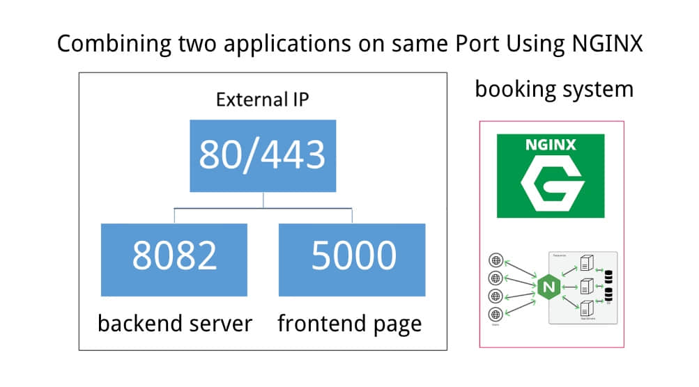

# CloudComputingServer


Access to Web Client Link: https://chenyilong.com/pages/login.html

----------------
 
Admin role username: elon2_admin
Admin role password: password123
 
---------------
 
User role username: customer
User role password: password123
 
---------------
 
User role username: customer02
User role password: password123


This is the API documents:
 
http://54.89.63.70:5000/swagger-ui/index.html
 
and at the end of the report , we also give a list of API.


## User's manual


## Technical Introduction:
Proposal type: Option B (develop a web application and deploy the application in the cloud)
Stakeholders: sport playground business owner and customer
Cloud Computing Platform: AWS 
Application Architecture: a Three-Tier application, which has a backend layer, database layer, and client layer.
Decoupling Services:  Restful API design: 
- User: /api/users/login 
- User: /api/users/register
- User: POST /api/orders
- User: GET /api/orders/{id}
- User and Administrator: PUT /api/orders/{id} (status: waiting, done)
- User: DELETE /api/orders/{id}
- Administrator: POST /api/courts (include upload files )
- Administrator: GET /api/courts/{id}
- Administrator: PUT /api/courts/{id}  (include upload files )
- Administrator: DELETE /api/courts/{id}

Security: Spring Security and JWT

Host Mapping in development environment: 


host | mock host | description
-|-|-
127.0.0.1|              chenyilong.com | mock host

API document: Swagger, document URL for localhost:  


This is the API documents:
 
http://54.89.63.70:5000/swagger-ui/index.html
 
 


Deployment on the cloud: deploy client side and back end (Restful API) on  AWS Lambda.

Cloud Database: We will choose NoSQL databases DynamoDB

Storage: web application assets such as pictures, files, etc., will be stored on cloud storage services such as AWS S3.

Languages/Framework:  Java for Backend Service, and JS/ React/Vue to develop web applications.

Code on GitHub:  https://github.com/AUTCloudComputing/CloudComputingServer 

 
 
## nginx config




mock host | description
-|-
chenyilong.com/api/ | backend/server host
chenyilong.com/ | frontend/web host


Nginx Config: 

start nginx

 ```shell
sudo yum install nginx
nginx
 ```


reload nginx


 ```shell
sudo nginx -s stop && sudo nginx

 ```


 ```Java
# Load dynamic module configurations
include /usr/local/etc/nginx/modules/*.conf;

events {
    worker_connections 1024;
}

http {
    include mime.types;
    default_type application/octet-stream;
    sendfile on;
    keepalive_timeout 65;

    # Universal server for handling both backend API and front-end
    server {
        listen 80;
        server_name chenyilong.com;

        # Location block for API
        location /api/ {
            # CORS headers
            add_header 'Access-Control-Allow-Origin' '*';
            add_header 'Access-Control-Allow-Methods' 'GET, POST, OPTIONS';
            add_header 'Access-Control-Allow-Headers' 'DNT,User-Agent,X-Requested-With,If-Modified-Since,Cache-Control,Content-Type,Range,Authorization';
            add_header 'Content-Type' 'text/plain; charset=utf-8';

            # Set headers for proxying
            proxy_set_header X-Real-IP $remote_addr;
            proxy_set_header Host $http_host;
            proxy_set_header X-Forwarded-For $proxy_add_x_forwarded_for;

            # Proxy pass to backend API
            proxy_pass http://127.0.0.1:5000;  # API server
        }

        # Location block for front-end
        location / {
            proxy_set_header X-Real-IP $remote_addr;
            proxy_set_header Host $http_host;
            proxy_set_header X-Forwarded-For $proxy_add_x_forwarded_for;

            # Proxy pass to front-end
            proxy_pass http://127.0.0.1:8082;  # front-end server 
        }
    }
}

 ```

- using-secrets-in-github-actions to save secrets key instead of git ignore. (Reference: https://docs.github.com/en/actions/security-guides/using-secrets-in-github-actions ) 
